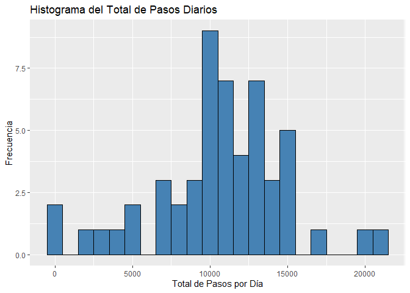
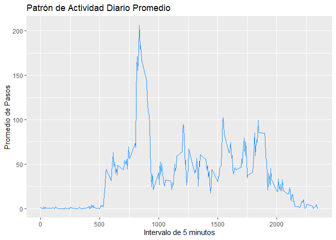
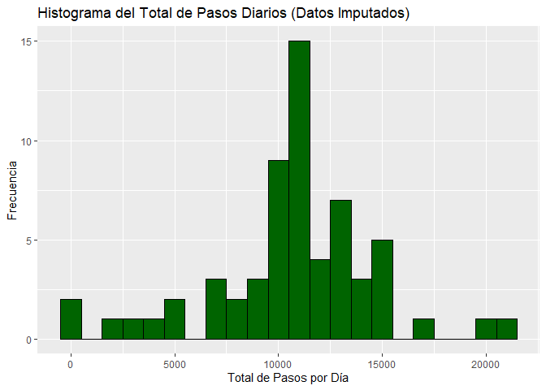
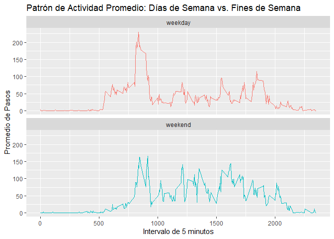

## Loading and preprocessing the data


``` r
# Nombre del archivo zip y del archivo de datos
zipFile <- "activity.zip"
dataFile <- "activity.csv"

# Descomprimir el archivo zip si el archivo de datos no existe
if (!file.exists(dataFile)) {
  unzip(zipFile)
}
# Cargar los datos desde el archivo CSV
activity_data <- read.csv("activity.csv")

# Convertir la columna 'date' a la clase Date
activity_data$date <- as.Date(activity_data$date)
```

## What is mean total number of steps taken per day?


``` r
steps_per_day <- activity_data %>%
  filter(!is.na(steps)) %>%
  group_by(date) %>%
  summarise(total_steps = sum(steps))

head(steps_per_day)
```

```
## # A tibble: 6 × 2
##   date       total_steps
##   <date>           <int>
## 1 2012-10-02         126
## 2 2012-10-03       11352
## 3 2012-10-04       12116
## 4 2012-10-05       13294
## 5 2012-10-06       15420
## 6 2012-10-07       11015
```

Histograma del total de pasos por día


``` r
ggplot(steps_per_day, aes(x = total_steps)) +
  geom_histogram(binwidth = 1000, fill = "steelblue", color = "black") +
  labs(title = "Histograma del Total de Pasos Diarios",
       x = "Total de Pasos por Día",
       y = "Frecuencia")
```

<!-- -->


## What is the average daily activity pattern?

Media y Mediana del total de pasos por día


``` r
mean_steps <- mean(steps_per_day$total_steps)
median_steps <- median(steps_per_day$total_steps)

cat("Media del total de pasos por día:", round(mean_steps, 2), "\n")
```

```
## Media del total de pasos por día: 10766.19
```

``` r
cat("Mediana del total de pasos por día:", median_steps, "\n")
```

```
## Mediana del total de pasos por día: 10765
```

Gráfico de series de tiempo del patrón de actividad

Calculamos el promedio de pasos para cada intervalo de 5 minutos a lo largo de todos los días.


``` r
steps_by_interval <- activity_data %>%
  filter(!is.na(steps)) %>%
  group_by(interval) %>%
  summarise(average_steps = mean(steps))

ggplot(steps_by_interval, aes(x = interval, y = average_steps)) +
  geom_line(color = "dodgerblue") +
  labs(title = "Patrón de Actividad Diario Promedio",
       x = "Intervalo de 5 minutos",
       y = "Promedio de Pasos")
```

<!-- -->

Intervalo de 5 min con el máximo número de pasos en promedio de todos los días:


``` r
max_interval <- steps_by_interval[which.max(steps_by_interval$average_steps), ]

cat("El intervalo con el máximo promedio de pasos es:", max_interval$interval, 
    "con un promedio de", round(max_interval$average_steps, 2), "pasos.\n")
```

```
## El intervalo con el máximo promedio de pasos es: 835 con un promedio de 206.17 pasos.
```

## Imputing missing values

Calcular el total de valores faltantes


``` r
total_missing_values <- sum(is.na(activity_data$steps))

cat("El número total de filas con valores faltantes (NA) es:", total_missing_values, "\n")
```

```
## El número total de filas con valores faltantes (NA) es: 2304
```

``` r
# Crear una copia del conjunto de datos original
imputed_data <- activity_data

# Rellenar los NA usando la media del intervalo correspondiente
imputed_data$steps <- ifelse(is.na(imputed_data$steps),
                             steps_by_interval$average_steps[match(imputed_data$interval, steps_by_interval$interval)],
                             imputed_data$steps)

# Verificar que ya no hay NAs
sum(is.na(imputed_data$steps))
```

```
## [1] 0
```
Ahora, repetimos el análisis del total de pasos diarios con el nuevo conjunto de datos completo.


``` r
# Calcular el total de pasos por día con los datos imputados
steps_per_day_imputed <- imputed_data %>%
  group_by(date) %>%
  summarise(total_steps = sum(steps))
```


``` r
# Histograma
ggplot(steps_per_day_imputed, aes(x = total_steps)) +
  geom_histogram(binwidth = 1000, fill = "darkgreen", color = "black") +
  labs(title = "Histograma del Total de Pasos Diarios (Datos Imputados)",
       x = "Total de Pasos por Día",
       y = "Frecuencia")
```

<!-- -->


``` r
# Media y Mediana
mean_imputed <- mean(steps_per_day_imputed$total_steps)
median_imputed <- median(steps_per_day_imputed$total_steps)

cat("Media (imputada):", round(mean_imputed, 2), "\n")
```

```
## Media (imputada): 10766.19
```

``` r
cat("Mediana (imputada):", round(median_imputed, 2), "\n")
```

```
## Mediana (imputada): 10766.19
```

La media y la mediana de los datos imputados son muy similares a las originales, pero ahora representan el total de todos los días del conjunto de datos. La imputación de datos nos proporciona una estimación más completa del total de pasos diarios al no descartar los días con valores faltantes.


## Are there differences in activity patterns between weekdays and weekends?
### 1. Crear una variable de factor para días de semana/fin de semana


``` r
# Establecer temporalmente la localización a inglés para asegurar que weekdays()
# devuelva "Saturday" y "Sunday" en lugar de "sábado" y "domingo".
Sys.setlocale("LC_TIME", "C")
```

```
## [1] "C"
```

``` r
imputed_data$day_type <- ifelse(weekdays(imputed_data$date) %in% c("Saturday", "Sunday"), 
                                "weekend", "weekday")
imputed_data$day_type <- as.factor(imputed_data$day_type)

head(imputed_data)
```

```
##       steps       date interval day_type
## 1 1.7169811 2012-10-01        0  weekday
## 2 0.3396226 2012-10-01        5  weekday
## 3 0.1320755 2012-10-01       10  weekday
## 4 0.1509434 2012-10-01       15  weekday
## 5 0.0754717 2012-10-01       20  weekday
## 6 2.0943396 2012-10-01       25  weekday
```

### 2. Gráfico de panel comparando los patrones de actividad


``` r
# Calcular el promedio de pasos por intervalo y tipo de día
steps_by_day_type <- imputed_data %>%
  group_by(interval, day_type) %>%
  summarise(average_steps = mean(steps))
```

```
## `summarise()` has grouped output by 'interval'. You can override using the
## `.groups` argument.
```

### 3. Comparación de la Media de Pasos

Ahora, podemos calcular la media de pasos para cada tipo de día.


``` r
mean_steps_by_day_type <- imputed_data %>%
  group_by(day_type) %>%
  summarise(mean_steps = mean(steps))

print(mean_steps_by_day_type)
```

```
## # A tibble: 2 × 2
##   day_type mean_steps
##   <fct>         <dbl>
## 1 weekday        35.6
## 2 weekend        42.4
```


``` r
# Crear el gráfico de panel
ggplot(steps_by_day_type, aes(x = interval, y = average_steps, color = day_type)) +
  geom_line() +
  facet_wrap(~day_type, ncol = 1, nrow = 2) +
  labs(title = "Patrón de Actividad Promedio: Días de Semana vs. Fines de Semana",
       x = "Intervalo de 5 minutos",
       y = "Promedio de Pasos") +
  theme(legend.position = "none")
```

<!-- -->

Se observa mayor actividad los fines de semana en el gráfico de serie de tiempo para cada tipo de día. También se observa que el promedio de pasos es de 42.4 los fines de semana y de 35.6 los días de semana. Lo cual es bastante bajo en general.
